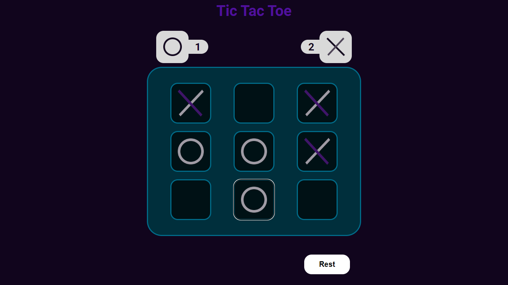

# BGTic

A simple Tic Tac Toe game built with React, Vite, TypeScript, and CSS. You can play against a friend or against the computer, and your progress and scores are saved in localStorage

<h2>Features</h2>

<ul>
   <li>Play against a friend or the computer.</li>
   <li>Easy-to-use user interface.</li>
   <li>Keeps track of scores.</li>
   <li>Reset the game at any time.</li>
   <li>Enjoy a classic game in a modern web application.</li>
   <li>Progress and scores are saved in localStorage for future sessions.</li>
   <li>Stylish and responsive design for an enjoyable gaming experience</li>
</ul>

<h2>Demo</h2>
You can try out the game here: <a href="">BGTic Demo</a>

<h2>Game Modes</h2>
The Tic Tac Toe game offers two game modes:
<ul>
   <li><strong>Multiplayer</strong>: Play against a friend. Take turns and compete to win.</li>
   <li><strong>Single Player</strong>: Play against the computer (CPU). The CPU makes moves based on a simple logic. Can you beat it?</li>
</ul>
